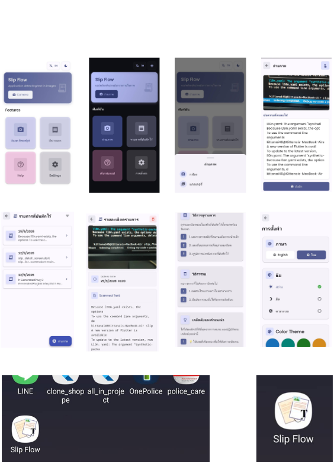

# Application : Slip Flow

  

  <b>Slip Flow</b> 
  แอปพลิเคชันสำหรับสแกนข้อความจากรูปภาพด้วย OCR 
  เพื่อแปลงข้อความภายในภาพออกมาเป็น Text แบบอัตโนมัติ

-------------

# Preview Application

  

-------------

# About Application

Slip Flow เป็นแอปพลิเคชันที่พัฒนาด้วย Flutter  
สำหรับช่วยดึงข้อความจากรูปภาพให้ออกมาเป็นข้อความ (Text)  
โดยใช้ OCR (Optical Character Recognition)

ผู้ใช้งานสามารถนำรูปภาพ เช่น
- สลิปโอนเงิน
- เอกสาร
- ใบเสร็จ
- รูป Screenshot
- หรือรูปภาพที่มีข้อความ

มาทำการสแกนเพื่ออ่านข้อมูลข้อความภายในรูปภาพได้อย่างรวดเร็ว  
ช่วยลดเวลาในการพิมพ์ข้อความใหม่ และเพิ่มความสะดวกในการจัดการข้อมูล

-------------

# Features

- สแกนข้อความจากรูปภาพ
- ดึงข้อความออกจากรูปภาพให้อยู่ในรูปแบบ Text
- รองรับหลายภาษา เช่น ไทย และ English
- บันทึกประวัติการสแกนย้อนหลัง
- ประมวลผลรวดเร็วและใช้งานง่าย
- ออกแบบ UI ให้ใช้งานง่าย 
- สามารถตั้งค่าภาษาและธีมของแอปพลิเคชันได้

-------------

# Technology Stack

- Flutter
- Dart
- OCR Technology
- ocr_scan: ^0.2.2
- Material Design

-------------
